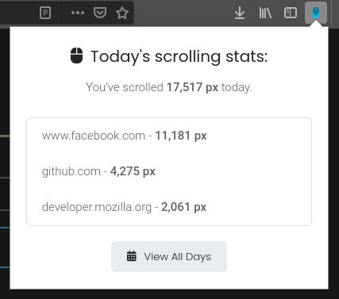

# scroll-tracker

> Browser extension to track your scrolling distance

[Install for Firefox](https://addons.mozilla.org/en-US/firefox/addon/scroll-tracker) · [Install for Chrome](https://chrome.google.com/webstore/detail/scroll-tracker/mefkhodoaoahcffhciblojjgmfpcgeod)

## Building

Run `yarn install` to install dependencies, then `yarn build` to build the JS stuff.

## Development

Use `yarn watch` to automatically rebuild your changes during development.
